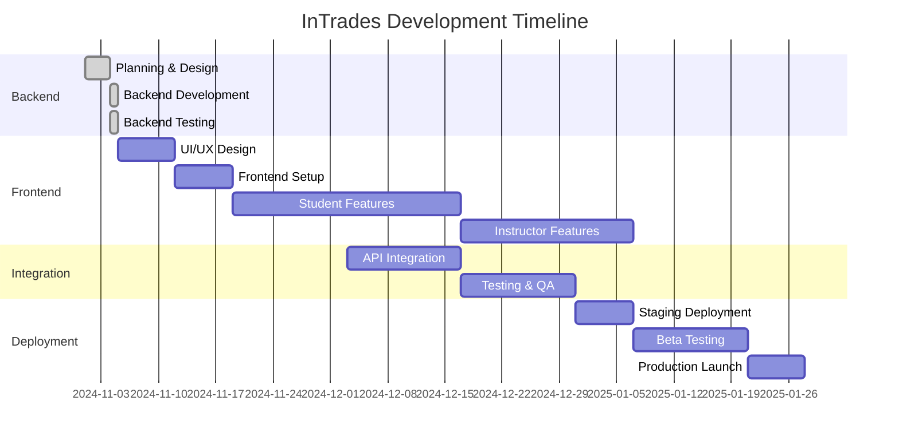

# 🗺️ InTrades Project Roadmap

## 📊 Project Status Overview

### ✅ Completed (Phase 1)
- **Backend Development**: 100% Complete
  - Authentication system with JWT
  - Challenge management system
  - XP & Badge gamification
  - File upload with AWS S3
  - 35+ API endpoints
  - GitHub deployment

### 🚧 In Progress (Phase 2)
- **Frontend Development**: 0% Complete
- **Testing & QA**: 20% Complete
- **Documentation**: 40% Complete

### 📅 Timeline Summary



## 🎯 Milestone Schedule

### ✅ Milestone 1: Backend Complete (ACHIEVED)
**Date**: November 4, 2024  
**Deliverables**:
- ✅ Complete REST API
- ✅ Database schema implemented
- ✅ Authentication system
- ✅ File upload system
- ✅ Deployed to GitHub

### 🎯 Milestone 2: MVP Frontend
**Target Date**: December 15, 2024  
**Deliverables**:
- [ ] Student dashboard
- [ ] Challenge completion flow
- [ ] Basic leaderboard
- [ ] Profile management
- [ ] Mobile responsive design

### 🎯 Milestone 3: Full Feature Set
**Target Date**: January 7, 2025  
**Deliverables**:
- [ ] Instructor dashboard
- [ ] Challenge creation tools
- [ ] Analytics dashboard
- [ ] Notification system
- [ ] Team challenges

### 🎯 Milestone 4: Production Ready
**Target Date**: January 21, 2025  
**Deliverables**:
- [ ] Performance optimized
- [ ] Security audited
- [ ] Documentation complete
- [ ] CI/CD pipeline
- [ ] Monitoring configured

### 🎯 Milestone 5: Launch
**Target Date**: February 1, 2025  
**Deliverables**:
- [ ] Production deployment
- [ ] User onboarding
- [ ] Support system
- [ ] Marketing materials
- [ ] Analytics tracking

## 📋 Sprint Plan (2-Week Sprints)

### Sprint 1 (Nov 5-18): Foundation
**Frontend Setup & Authentication**
- Set up React TypeScript project
- Configure Redux and routing
- Implement authentication UI
- Connect to backend API
- Deploy to staging

**Deliverables**:
- Login/Register pages
- Password reset flow
- Protected routes
- Profile page

### Sprint 2 (Nov 19-Dec 2): Student Core
**Dashboard & Challenges**
- Student dashboard layout
- Challenge list and details
- Quiz interface
- File submission

**Deliverables**:
- Main dashboard
- Challenge flow
- XP display
- Basic navigation

### Sprint 3 (Dec 3-16): Gamification
**XP, Badges & Leaderboard**
- XP progress animations
- Badge showcase
- Leaderboard component
- Streak tracking

**Deliverables**:
- Gamification UI
- Progress tracking
- Social features
- Achievements

### Sprint 4 (Dec 17-30): Instructor Tools
**Instructor Dashboard**
- Instructor layout
- Student management
- Basic analytics
- Challenge creation

**Deliverables**:
- Instructor portal
- Class management
- Simple reporting

### Sprint 5 (Dec 31-Jan 13): Polish
**Testing & Optimization**
- Unit testing
- Integration testing
- Performance optimization
- Bug fixes

**Deliverables**:
- 80% test coverage
- <2s load time
- PWA features
- Documentation

### Sprint 6 (Jan 14-27): Launch Prep
**Deployment & Beta**
- Production setup
- Beta testing
- Final fixes
- Launch preparation

**Deliverables**:
- Production deployment
- Beta feedback incorporated
- Launch materials
- Support documentation

## 🔑 Critical Path Items

### High Priority (Must Have for MVP)
1. ✅ Backend API (COMPLETE)
2. User authentication UI
3. Student dashboard
4. Challenge completion flow
5. Basic progress tracking
6. Mobile responsive design

### Medium Priority (Should Have)
1. Instructor dashboard
2. Advanced gamification
3. Social features
4. Analytics
5. Notifications
6. PWA features

### Low Priority (Nice to Have)
1. Advanced animations
2. Avatar customization
3. Native mobile apps
4. AI recommendations
5. Video tutorials
6. Forum/community

## 🚨 Risk Management

### Technical Risks
| Risk | Probability | Impact | Mitigation |
|------|------------|--------|------------|
| API performance issues | Low | High | Implement caching, optimize queries |
| Browser compatibility | Medium | Medium | Test on multiple browsers, use polyfills |
| Scalability concerns | Low | High | Use CDN, implement load balancing |
| Security vulnerabilities | Medium | High | Regular audits, penetration testing |

### Project Risks
| Risk | Probability | Impact | Mitigation |
|------|------------|--------|------------|
| Scope creep | High | Medium | Strict MVP definition, change control |
| Timeline delays | Medium | Medium | Buffer time, parallel workstreams |
| Budget overrun | Low | High | Fixed scope contracts, regular monitoring |
| User adoption | Medium | High | Beta testing, user feedback loops |

## 💼 Resource Allocation

### Current Team
- **Backend**: ✅ Complete
- **Frontend**: 1 developer needed
- **UI/UX**: 1 designer needed
- **QA**: 1 tester needed
- **DevOps**: Part-time needed

### Budget Allocation
- **Development**: $63,200 (80%)
- **Infrastructure**: $6,000/year (8%)
- **Testing**: $5,600 (7%)
- **Marketing**: $4,000 (5%)
- **Total**: ~$79,000

## 📈 Success Metrics

### Launch Metrics (Month 1)
- [ ] 100+ registered users
- [ ] 50+ daily active users
- [ ] 70% challenge completion rate
- [ ] <2s average load time
- [ ] 0 critical bugs

### Growth Metrics (Month 3)
- [ ] 500+ registered users
- [ ] 200+ daily active users
- [ ] 5+ instructor accounts
- [ ] 80% user retention
- [ ] 4.5+ app store rating

### Scale Metrics (Month 6)
- [ ] 2000+ registered users
- [ ] 800+ daily active users
- [ ] 20+ instructor accounts
- [ ] 3+ institutional clients
- [ ] Break-even on costs

## 🔄 Development Workflow

### Git Workflow
```
main (production)
  ├── staging (pre-production)
  │   ├── develop (integration)
  │   │   ├── feature/auth
  │   │   ├── feature/dashboard
  │   │   └── feature/challenges
  │   └── hotfix/critical-bug
  └── release/v1.0.0
```

### CI/CD Pipeline
1. **Push to feature branch** → Run tests
2. **PR to develop** → Code review + tests
3. **Merge to develop** → Deploy to dev environment
4. **Merge to staging** → Deploy to staging
5. **Merge to main** → Deploy to production

### Code Review Checklist
- [ ] Tests pass
- [ ] Documentation updated
- [ ] No console errors
- [ ] Responsive design verified
- [ ] Accessibility checked
- [ ] Performance impact assessed

## 🎓 Training & Documentation

### Developer Documentation
- [ ] API documentation (Swagger)
- [ ] Component library (Storybook)
- [ ] Architecture diagrams
- [ ] Deployment guides
- [ ] Troubleshooting guides

### User Documentation
- [ ] Student user guide
- [ ] Instructor manual
- [ ] Admin handbook
- [ ] Video tutorials
- [ ] FAQ section

### Training Plan
- [ ] Instructor onboarding webinar
- [ ] Student orientation video
- [ ] Admin training session
- [ ] Support team training
- [ ] Partner institution training

## 🚀 Go-to-Market Strategy

### Phase 1: Soft Launch (Feb 2025)
- Beta test with 1 institution
- Gather feedback
- Iterate on features
- Create case studies

### Phase 2: Limited Release (Mar 2025)
- Launch to 5 institutions
- Implement feedback
- Develop partnerships
- Build testimonials

### Phase 3: Full Launch (Apr 2025)
- Public availability
- Marketing campaign
- Conference presentations
- Media outreach

## 📞 Stakeholder Communication

### Weekly Updates
- Development progress
- Blockers and risks
- Budget status
- Timeline updates

### Monthly Reviews
- Milestone assessment
- User feedback summary
- Metrics dashboard
- Strategic decisions

### Quarterly Planning
- Roadmap adjustments
- Budget review
- Team scaling
- Market analysis

## ✅ Next Actions (This Week)

1. **Recruit frontend developer**
   - Post job listing
   - Review portfolios
   - Schedule interviews

2. **Set up frontend repository**
   - Create GitHub repo
   - Initialize React app
   - Configure CI/CD

3. **Design UI mockups**
   - Student dashboard
   - Challenge screens
   - Mobile layouts

4. **Prepare staging environment**
   - Set up Heroku
   - Configure MongoDB Atlas
   - Set up monitoring

5. **Create API documentation**
   - Swagger/OpenAPI spec
   - Postman collection
   - Integration guide

---

## 📌 Quick Links

- **Backend Repository**: [GitHub - InTrades Backend](https://github.com/bdatkinson/intrades-app)
- **Project Board**: [GitHub Projects](https://github.com/bdatkinson/intrades-app/projects)
- **API Documentation**: [Swagger Docs](#)
- **Design Mockups**: [Figma](#)
- **Meeting Notes**: [Google Drive](#)

## 🎯 Vision Statement

**"Transform every skilled trades student into a successful entrepreneur through gamified education that makes business learning engaging, practical, and achievable."**

---

*Last Updated: November 5, 2024*  
*Next Review: November 12, 2024*